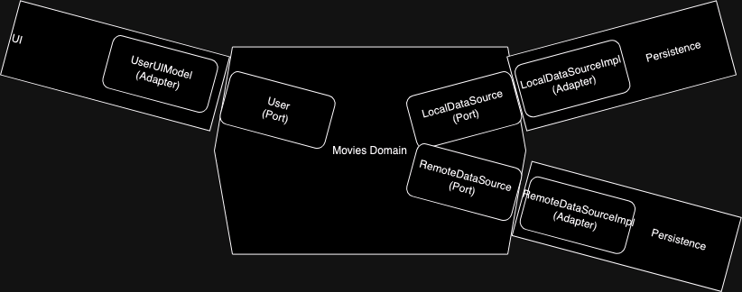
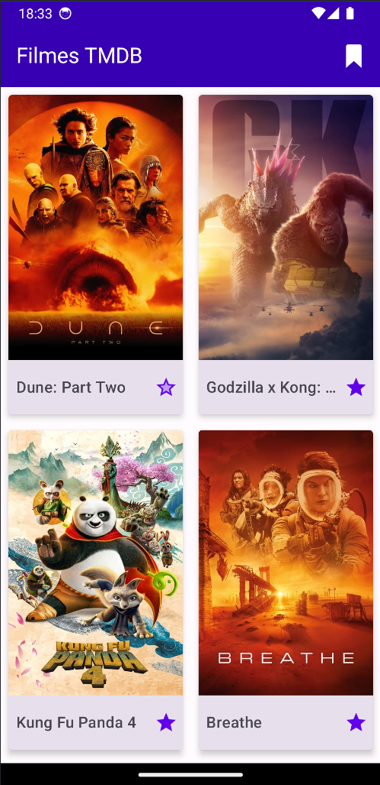
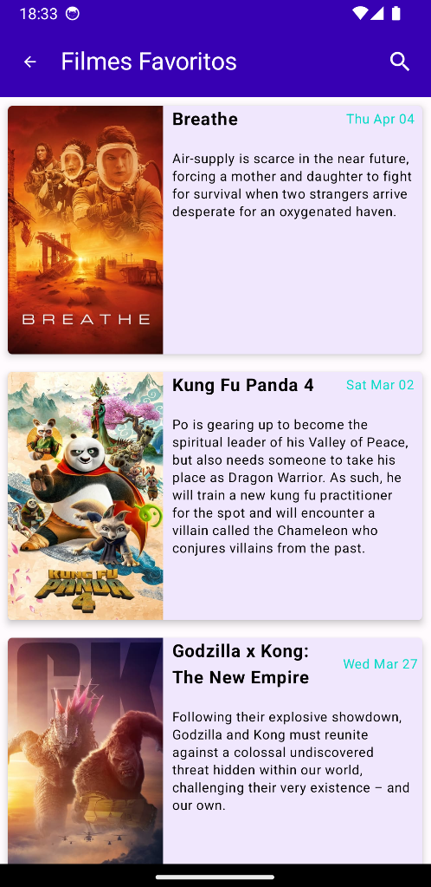
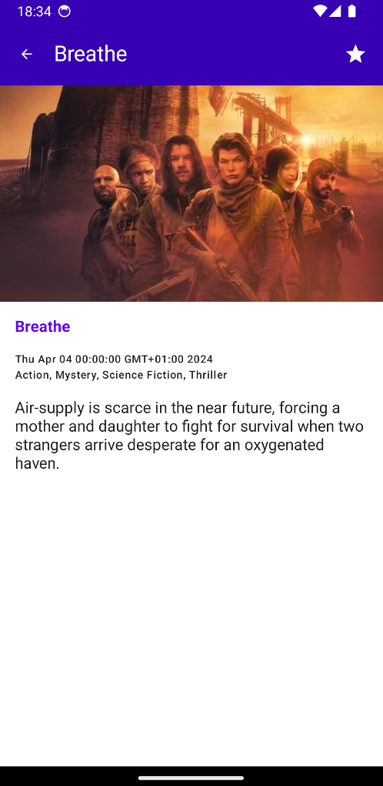

# Recruitment Process 2024 - Android Developer

The challenge is to better understand how you take care of android development using JetPack Compose, Hexagonal Architecture, and some state holders, for example. The project functionality can be chosen by you.

* * *

* ## What has been done:
  * Home screen listing the top classified movies. [endpoint](https://developers.themoviedb.org/3/movies/get-popular-movies)
  * Loading indicator when waiting API response.
  * Handling errors (e.g. If there is no favorite movie)
  * Favorite movies screen showing the movies that the user likes the most.
  * Movie detail screen showing more info about the movie and an alternative screenshot.
  * Pagination on Movie List
  * Saving favorite movies on SharedPreferences (This is not the perfect way, a solution with easier maintenance would be the use of Room database)

* ## What about the project in technical terms?
  * Hexagonal Architecture
  * Jetpack Compose
  * Multi Module project

* ## What libraries has been used:
  * Retrofit - Interface and client to the API, has a good integration with Kotlin Coroutines
  * OkHttp - To give support to Retrofit
  * Moshi - Converts JSON to objects and objects to JSON
  * Kotlin Coroutines - To make asynchronous calls
  * Kotlin Koin - Dependency injection
  * Picasso - To load images
  * Mockk - create mocked objects when testing
  * JUnit - Tests
  * Android Lifecycle - To better control lifecycle

* * *
* ## Why Hexagonal Architecture?
    * To create a flow of dependencies pointing to inwards (from Modules to the Domain). So our domain is free from dependencies and we can focus on business logic without worrying about Android technical stuff.
      

* * *
## Email
* E-mail: matheusfelipecorreaalves@gmail.com

* ## Demonstration
*  
*  
*  
